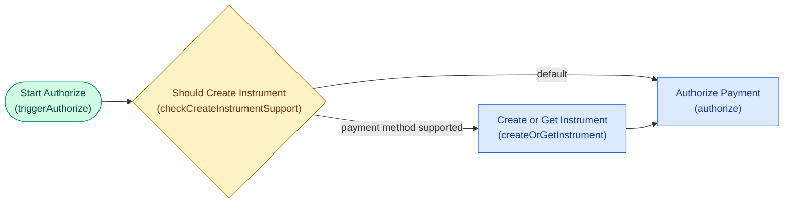

# MWF Editor

This skill helps edit and visualize Payrails **Modular Workflow (MWF)** JSON configurations. A merchant's MWF describes how a payment action (authorize, capture, cancel, refund, lookup) flows through triggers, conditions, and actions, with routing via `nextActions`.

## When this skill is active

- The user uploads or pastes an MWF JSON (recognizable by top-level `uiConfig` and `steps` keys).
- The user types `/mwf-editor` or otherwise invokes the skill explicitly.
- The user describes a workflow change in natural language and references an MWF (either currently in context or previously uploaded).
- The user asks to visualize, diagram, or map out an MWF flow.

If no MWF JSON is present in context and the user describes changes in the abstract, ask them to upload or paste the current config before producing an output — the skill edits existing configs, it does not invent them from scratch.

## Output modes

Decide output mode from the user's ask:

- **Edit mode** → The user wants changes applied. Phrases: "add", "remove", "insert", "change", "update", "swap", "rewire", "make it route through…", "edit". Output: the full updated JSON plus a change summary (see Edit Output Format).
- **Visualize mode** → The user wants to see the flow. Phrases: "show me", "visualize", "map out", "diagram", "draw", "what does this flow look like". Output: a Mermaid diagram (see Visualize Output Format).
- **Ambiguous** → If the ask touches both (e.g., "change X and show me what it looks like"), produce both: updated JSON + change summary, then the Mermaid diagram of the resulting flow.

## The MWF structure (what you're editing)

Every MWF has two top-level keys:

```
{
  "uiConfig": {
    "edges":   [ { "id": "<from>-<to>", "vertices": [...] }, ... ],
    "nodes":   [ { "id": "<stepCode>", "position": { "x": N, "y": N } }, ... ],
    "overrideAutoLayout": bool,
    "visibleActionStatusesByStepCode": { ... }
  },
  "steps": [ { "name", "code", "type", "params" }, ... ]
}
```

`steps[]` has three types — each with a distinct `params` shape. Before editing, read the reference files:

- **`references/mwf-schema.md`** — full JSON templates for each step type, edge-id conventions, the blank template, and common editing mechanics (how to insert, remove, rewire).
- **`references/workflow-studio-concepts.md`** — the semantic model: what outcomes mean (Completed/Paused/Requested/Updated), the full catalog of trigger and action types, 3DS mode interaction, rule operators, and design principles. Read this when you need to decide *what* the flow should do, not just what shape the JSON takes.
- **`references/patterns.md`** — fourteen canonical patterns (standard acceptance, fraud check, conditional routing by payment method, auto-capture with delay, retry on failure, forced-vs-skipped 3DS parallel branches, updated-outcome handling, notification fan-out, multi-vendor fraud scoring, scheduled capture by payment method, smart retry with notification, event-driven status handling, BIN-based 3DS routing, and order-update fraud routing). Match the user's request to a pattern when possible — it keeps the output idiomatic.

Don't freestyle the JSON shape; use the templates. Don't invent outcomes or action types; use the catalog.

The key invariants:

- Every step has a unique `code`. Edges in `uiConfig` reference step codes via the `id` pattern `<fromCode>-<toCode>` (or `<fromCode>-<toCode>-<suffix>` when there are multiple edges between the same pair).
- Every `addNextStep` in a step's `nextActions`/`actions`/`defaultActions` must point to a `code` that exists in `steps[]`.
- Every node in `uiConfig.nodes` corresponds to a step `code`, and every edge should correspond to a real routing relationship in `steps[]`.

## Edit mode — how to apply changes

1. **Parse the JSON from the user's upload or message.** If it's huge, read it in full anyway — you need to understand the shape to avoid breaking references.
2. **Plan the change.** Walk the `steps` array mentally or on paper. Decide: which steps are added, removed, modified? Which edges need adding/removing? Which `nextActions` blocks need updating?
3. **Apply the change.** Produce the complete updated JSON. Preserve everything you aren't explicitly changing — including ordering of keys where practical, existing step names, existing mappings, existing `uiConfig.nodes` positions. The goal is a minimal diff.
4. **For newly added steps**, also add the corresponding `uiConfig.nodes` entry with a sensible position (pick an x/y that roughly fits between the neighbors it connects — e.g., for a step inserted between A at x=1000 and B at x=2000, put the new node around x=1500 at a similar y). Add the corresponding `uiConfig.edges` entries using the `<from>-<to>` id convention.
5. **Validate before returning.** Run the structural checks below. If anything fails, fix it before producing output — do not hand the user a broken config.

### Structural validation checklist

Before outputting an edited JSON, confirm:

- [ ] Every `steps[].code` is unique.
- [ ] Every `addNextStep` `code` reference points to an existing step.
- [ ] Every `uiConfig.edges[].id` decodes into `<fromCode>-<toCode>[-<suffix>]` where both codes exist as steps.
- [ ] Every `uiConfig.nodes[].id` matches a step code, and every step has a node entry.
- [ ] No step is orphaned (unreachable from any trigger) unless the user explicitly asked to leave it dangling.
- [ ] Step types are one of `trigger`, `action`, `condition`.
- [ ] Condition steps have at least one `rules[]` entry OR a `defaultActions[]`.
- [ ] AND compound conditions use the binary tree shape `{left, operator: "AND", right}` — not a flat `conditions` array.
- [ ] Rules with multiple `addNextStep` targets (fan-out) have corresponding `uiConfig.edges` for each target, with `-1`, `-2` suffixes.
- [ ] Every terminal branch emits an `addWorkflowExecutionStatus` with the correct `{action}{Outcome}` naming convention.
- [ ] Static value mappings use `{to, value}` (no `from` field); field-to-field mappings use `{from, to}`.
- [ ] Delays use ISO 8601 duration strings (`P1D`, `P0D`, `PT5M`, etc.) on the `addNextStep` params, not on the target step.

If the user asks for a change that would break an invariant (e.g., "remove the authorize step" while other steps still route to it), flag the issue in the change summary and either fix the downstream references as part of the edit (preferred, tell the user what you did) or ask for clarification if the right fix isn't obvious.

### Edit Output Format

After applying the change, return two things in this order:

1. **The full updated JSON**, in a single fenced ` ```json ` block. Complete config — no ellipses, no placeholders, no "rest of file unchanged" comments.
2. **A Changes section**, formatted like this:

```
## Changes

**Added**
- `stepCode` (<type>) — <one-line description of what it does and why it was added>

**Removed**
- `stepCode` — <reason>

**Modified**
- `stepCode` — <what changed, e.g. "added new rule matching fraudScore > 80 routing to manualReview">

**uiConfig**
- Added nodes: `stepCode1`, `stepCode2`
- Added edges: `stepA-stepB`, `stepB-stepC`
- Removed edges: `stepX-stepY`
```

Only include subsections that are non-empty. Keep each bullet to one line where possible — the summary is a quick orientation, not a re-explanation.

## Visualize mode — Mermaid output format

Produce a **left-to-right flowchart** using Mermaid. Flows are LR because MWFs are sequential-with-branches and read naturally left-to-right, matching how Payrails itself lays them out.

Use shapes + colors to distinguish step types:

- **Trigger** → stadium shape `([Label])`, class `trigger` (green).
- **Action** → rectangle `[Label]`, class `action` (blue).
- **Condition** → rhombus/diamond `{Label}`, class `condition` (amber).

Label each node with both the human-readable `name` and the `code` on a second line, like `"Authorize Payment\n(authorize)"`. Use the step `code` as the Mermaid node id (sanitize any non-alphanumeric chars if needed).

Edges: derive from `nextActions`. Label edges with routing context when meaningful:

- For condition steps: label outgoing edges with the rule `name` (or a short version of the condition), and label the default path `default`.
- For action steps with multiple lifecycle hooks: label edges with `onCompleted` / `onPaused` / `onUpdated` when the action has more than one of these.
- For simple linear hops with no branching, no edge label is needed.

### Mermaid template



Return the Mermaid inside a single fenced ` ```mermaid ` block. If the user also asked for a JSON edit, put the JSON + Changes first, then the Mermaid under a `## Flow diagram` heading.

If the workflow has multiple independent entry points (e.g., separate triggers for authorize / capture / cancel / refund / lookup — common in full payment MWFs), group them visually by putting a Mermaid subgraph per trigger chain, or add a comment line like `%% === Refund flow ===` before each trigger's subtree. This keeps the diagram readable for large workflows.

## Natural-language flow specs (no JSON uploaded)

Sometimes the user will describe a flow in words and ask you to produce an MWF from scratch. In that case:

1. Ask once, briefly, whether they want you to base it on an existing MWF they can upload, or build from a blank template. If they confirm blank-template, proceed.
2. Use the blank template pattern in `references/mwf-schema.md` as scaffolding — a single trigger plus one action plus a terminal notification step. Build outward from there, matching the shapes used in real MWFs.
3. Always produce both the JSON and the Mermaid diagram in this case, since the user needs to validate both structure and flow.

## Tips

- **Don't silently rewrite things that weren't asked for.** If you notice something that looks off in the original config (e.g., an orphaned step, a mapping with a typo), call it out in the Changes section as an observation rather than silently "fixing" it, unless the user explicitly asked you to clean up.
- **Preserve order.** Keep the `steps` array in its original order when editing, inserting new steps at the position that makes the flow easiest to read (typically right after the step that routes into it).
- **Preserve style.** If the existing MWF uses a particular naming convention for step codes (camelCase, `checkXResult`, `triggerX`), match it for any new steps you introduce.
- **When in doubt, read the references.** `mwf-schema.md` for JSON shape, `workflow-studio-concepts.md` for semantics, `patterns.md` for idiomatic flow structures.

## Recognizing common patterns in uploaded workflows

The uploaded MWFs in the wild typically contain combinations of these patterns. Recognizing them helps you edit sensibly:

- **Parallel 3DS branches** — step codes like `decide3DSpath`, `force3DSAuthorize`, `skip3DSAuthorize`, `force3DSCreateOrGetInstrument`. Don't flatten these; they exist because some flows must force 3DS and others must skip it.
- **Three-way 3DS routing post-instrument** — codes like `authorizeWithout3DS`, `authorizeWith3DS`, `authorize` (Default mode). The `checkInstrumentResult` condition routes to one of three authorize variants based on BIN allowlists, country mismatch, or `meta.risk.force3DS` flags. Each variant has its own result-checking condition downstream. Don't merge these — they carry different `settings.threeDSMode` values and different retry behaviors.
- **Standard result check** — codes like `checkAuthorizeResult`, `checkCaptureResult`, `checkCancelResult`, `checkRefundResult`. Each is a condition reading `success` from the preceding action, routing to Notify on either branch.
- **Updated-outcome handling** — codes like `checkAuthorizeUpdatedResult` + `sendActionUpdatedNotification`. These handle late reconciliation updates from providers.
- **Shared notification fan-out** — a single `sendActionCompletedNotification` step reached from multiple upstream conditions across all lifecycle flows.
- **Instrument support gate** — a condition like `checkCreateInstrumentSupport` that routes supported payment methods through `createOrGetInstrument` before authorizing, and unsupported methods straight to authorize.
- **Multi-vendor fraud scoring** — paired steps like `preAuthFraudScoreGreyHound` / `preAuthFraudScoreFlix` and `postAuthFraudScoreGreyHound` / `postAuthFraudScoreFlix`. The eligibility condition routes to the correct vendor based on shop code or merchant context using AND compound conditions. After post-auth fraud, `Prevent` decisions fan out to both notify AND auto-cancel.
- **Scheduled capture by payment method** — a `scheduleCaptureByPaymentMethod` condition step between authorize-success and capture, using `delay: "P1D"` for the default path and no delay for instant-capture methods (Klarna). Both paths inject a static `reasonDescription` via value-only mapping.
- **Smart retry with notification** — result-check conditions where failure rules fan out to TWO `addNextStep` targets: one back to authorize (retry with `delay: "P0D"`) and one to `sendActionCompletedNotification`. This gives the merchant intermediate failure visibility while retrying.
- **Event triggers for async updates** — `handlePaymentUpdatedEvent` (type: event, name: PaymentStatusUpdated) routes through `checkExternalPaymentEvent` which uses AND conditions to match on action type (refund/cancel/capture) plus success/failure. `handleDisputeUpdatedEvent` routes disputes to vendor-specific fraud update steps.
- **Order update with fraud routing** — `triggerOrderUpdate` (POST /orderUpdate) routes through a `checkShopCode` condition to vendor-specific `fraudUpdate` steps (e.g., `fraudUpdateGreyHound`, `fraudUpdateFlix`).
- **AND compound conditions** — binary tree structure `{left, operator: "AND", right}` rather than a flat array. Seen extensively for multi-field matching: payment method + shop code, success + BIN list, action type + status. Nested ANDs chain via the `right` field.
- **Static value injection in mappings** — `{to, value}` entries (no `from` field) that inject constants like country codes (`meta.customer.country.code`), risk exemption indicators (`meta.risk.exemptionIndicator: "lowValue"`), boolean flags (`meta.risk.force3DS: true`), and reason descriptions into downstream steps.

If the user asks to change something that cuts across one of these patterns (e.g., "remove 3DS from the card flow"), apply the change consistently across the pattern rather than just the single step they named. Mention what you did in the Changes section.

## Output etiquette

- **Produce the full JSON, never excerpts.** Merchants paste this back into Workflow Studio; partial outputs are useless. No `...`, no "rest unchanged" placeholders.
- **Preserve ordering, naming, positions.** Match the existing MWF's conventions for code naming (`camelCase`, `checkXResult`, `triggerX`). Keep `uiConfig.nodes[].position` for steps you didn't touch. For steps you added, pick positions that keep the canvas readable.
- **Flag observations, don't silently rewrite.** If you notice an issue outside the user's request, mention it in the Changes section under an `**Observations**` subheading — don't alter the JSON unasked.
